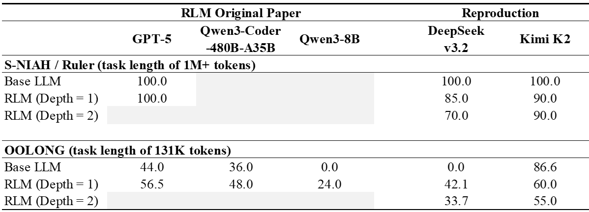
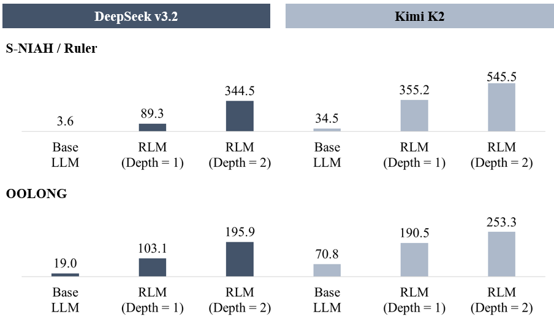
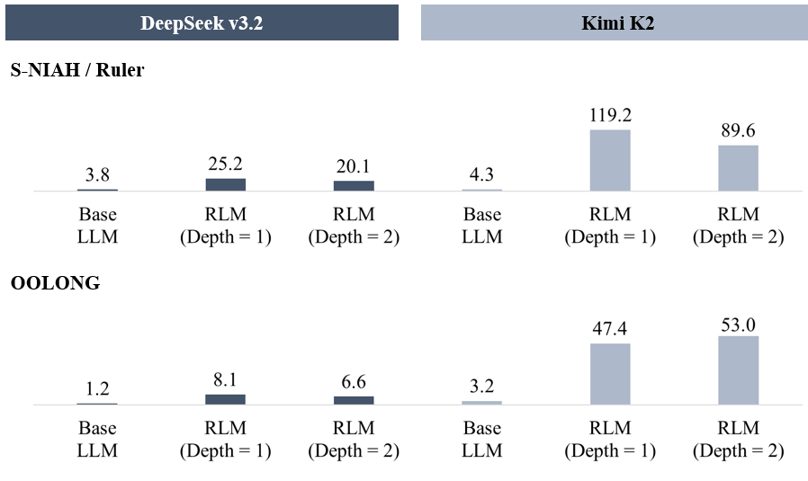
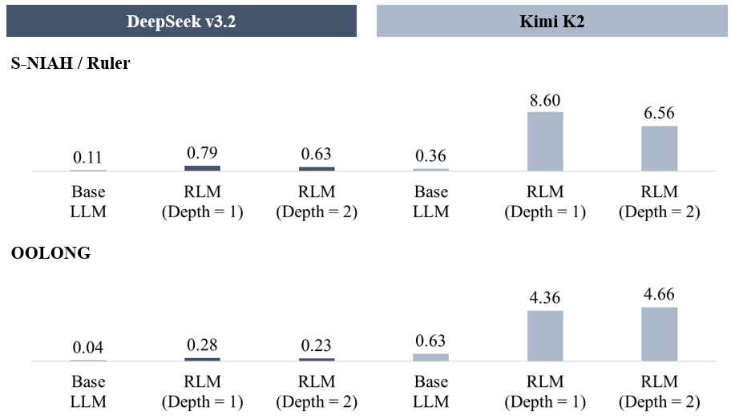

# Think, But Don't Overthink: Reproducing Recursive Language Models

> **FTEC5660 Individual Project** — Daren Wang, The Chinese University of Hong Kong
>
> [Full Report (PDF)](reproduction_report.pdf) &nbsp;|&nbsp; [Original RLM Paper](https://arxiv.org/abs/2512.24601) &nbsp;|&nbsp; [Original RLM Code](https://github.com/alexzhang13/rlm)

---

## Overview

This project reproduces and extends the **Recursive Language Models (RLM)** framework by Zhang et al. (2026). RLMs enable LLMs to process near-infinite contexts by offloading the prompt into an external Read-Eval-Print Loop (REPL) environment, allowing the model to programmatically examine, decompose, and recursively query sub-sections of the input.

**Key modification:** The original paper uses a default recursion depth of 1. I introduce **depth=2** as a novel test case and evaluate both **DeepSeek v3.2** and **Kimi K2** across two benchmarks — S-NIAH (simple retrieval) and OOLONG (complex reasoning).

### Key Findings

| Benchmark | Condition | DeepSeek v3.2 | Kimi K2 |
|-----------|-----------|:---:|:---:|
| **S-NIAH** | Base LLM | 100.0% | 100.0% |
| | RLM (depth=1) | 85.0% | 90.0% |
| | RLM (depth=2) | 70.0% | — |
| **OOLONG** | Base LLM | 0.0% | 86.6% |
| | RLM (depth=1) | 42.1% | 60.0% |
| | RLM (depth=2) | 33.7% | 55.0% |

- **Simple tasks (S-NIAH):** RLMs *hurt* performance — the REPL adds unnecessary overhead to an O(1) retrieval problem.
- **Complex tasks (OOLONG):** RLM depth=1 dramatically boosts weaker models (DeepSeek: 0% → 42.1%), but *degrades* already-capable models (Kimi K2: 86.6% → 60.0%).
- **Deeper recursion always hurts:** Depth=2 uniformly degrades accuracy while causing exponential latency (3.6s → 344.5s) and token cost explosions.

---

## Results

### Performance Comparison



### Execution Time, Token Usage, and Cost

| | |
|---|---|
|  |  |
|  | |

---

## Repository Structure

```
rlm-reproduction/
├── rlm/                     # RLM framework (submodule, with think-tag fix)
├── RULER/                   # RULER benchmark (submodule)
├── oolong/                  # OOLONG benchmark (submodule)
├── experiments/             # All experiment scripts (see experiments/README.md)
│   ├── run_ruler_*.py       # S-NIAH experiment runners
│   ├── run_oolong_*.py      # OOLONG experiment runners
│   ├── compare_results.py   # Aggregate and compare all runs
│   └── .env.template        # API key template
├── reproduction_results/    # Raw experiment outputs (JSON + CSV)
├── figures/                 # Result visualizations
├── reproduction_report.pdf  # Full report
└── README.md
```

---

## Quick Start

### 1. Clone (with submodules)

```bash
git clone --recurse-submodules https://github.com/drbillwang/rlm-reproduction.git
cd rlm-reproduction
```

If you already cloned without `--recurse-submodules`:

```bash
git submodule update --init --recursive
```

### 2. Install dependencies

```bash
# Python 3.10+ recommended
python -m venv .venv
source .venv/bin/activate   # On Windows: .venv\Scripts\activate

# Install RLM in editable mode
cd rlm && pip install -e . && cd ..

# Install experiment dependencies
pip install datasets python-dotenv openai
```

### 3. Configure API keys

```bash
cd experiments
cp .env.template .env
```

Edit `.env` and fill in your credentials:

```dotenv
# DeepSeek v3.2
DEEPSEEK_API_KEY=sk-...
DEEPSEEK_BASE_URL=https://api.deepseek.com/v1

# Kimi K2 (Volcano Engine)
KIMI_API_KEY=...
KIMI_BASE_URL=...

# Or generic OpenAI-compatible
OPENAI_API_KEY=sk-...
```

> `.env` is git-ignored. No secrets are committed.

### 4. Run experiments

```bash
cd experiments

# --- S-NIAH (RULER) ---
python run_ruler_plain.py       # Base LLM (no RLM)
python run_ruler_baseline.py    # RLM depth=1
python run_ruler_depth2.py      # RLM depth=2

# --- OOLONG (trec_coarse) ---
python run_oolong_plain.py      # Base LLM (no RLM)
python run_oolong_depth1.py     # RLM depth=1
python run_oolong_depth2.py     # RLM depth=2

# --- Aggregate all results ---
python compare_results.py
```

Results are saved to `experiments/results/` as JSON files.

> Pre-computed results are available in `reproduction_results/` for both DeepSeek v3.2 and Kimi K2.

---

## Experimental Design

### Benchmarks

| Benchmark | Task | Complexity | Metric |
|-----------|------|:---:|--------|
| **S-NIAH** (RULER) | Find a hidden phrase in irrelevant text | O(1) | Exact-match accuracy |
| **OOLONG** (trec_coarse) | Semantic aggregation over full dataset | O(N) | Numerical: max(0, 1 − 0.75·\|y − ŷ\|); Others: exact match |

- S-NIAH: 20 samples from `experiments/data/ruler/niah_single_2/validation.jsonl`
- OOLONG: 20 samples from HuggingFace `oolongbench/oolong-synth` (validation split, `trec_coarse`)

### Conditions

| Condition | Description |
|-----------|-------------|
| **Base LLM** | Direct single LLM call — no RLM, no REPL |
| **RLM (depth=1)** | REPL + code generation, but sub-calls use plain LLM |
| **RLM (depth=2)** | Sub-calls can spawn their own REPL environments |

### Models

- **DeepSeek v3.2** — via OpenAI-compatible API (`deepseek-chat`)
- **Kimi K2** — via Volcano Engine (ByteDance) OpenAI-compatible endpoint

---

## Code Modification to RLM

The `rlm/` submodule points to my fork ([drbillwang/rlm](https://github.com/drbillwang/rlm), branch `ftec5660-reproduction`). The only change is a `strip_think_tags()` helper added to `rlm/rlm/utils/parsing.py` that removes `<thinking>...</thinking>` blocks from model responses before parsing. This was necessary for compatibility with Kimi K2's reasoning output format. All other RLM code is unmodified.

---

## Limitations

- **Models differ from the original paper:** I use DeepSeek v3.2 and Kimi K2 instead of GPT-5 / Qwen. Absolute scores are not directly comparable; I focus on relative trends.
- **Subset size:** 20 samples per condition (original paper used 50) due to API cost constraints.
- **Benchmarks:** Only S-NIAH and OOLONG trec_coarse are reproduced. BrowseComp-Plus, OOLONG-Pairs, and CodeQA are not included.

---

## References

- Zhang, A. L., Kraska, T., & Khattab, O. (2026). *Recursive Language Models.* [arXiv:2512.24601](https://arxiv.org/abs/2512.24601)
- Hsieh, C.-P. et al. (2024). *RULER: What's the Real Context Size of Your Long-Context Language Models?* [arXiv:2404.06654](https://arxiv.org/abs/2404.06654)
- Bertsch, A. et al. (2025). *Oolong: Evaluating Long Context Reasoning and Aggregation Capabilities.* [arXiv:2511.02817](https://arxiv.org/abs/2511.02817)
- Liu, A. et al. (2025). *DeepSeek-v3.2.* [arXiv:2512.02556](https://arxiv.org/abs/2512.02556)
- Team, K. et al. (2025). *Kimi K2: Open Agentic Intelligence.* [arXiv:2507.20534](https://arxiv.org/abs/2507.20534)

---

## License

This repository is for the FTEC5660 individual project. All reproduction code lives in `experiments/`. Upstream code from RLM, RULER, and OOLONG is used as-is and properly cited.
